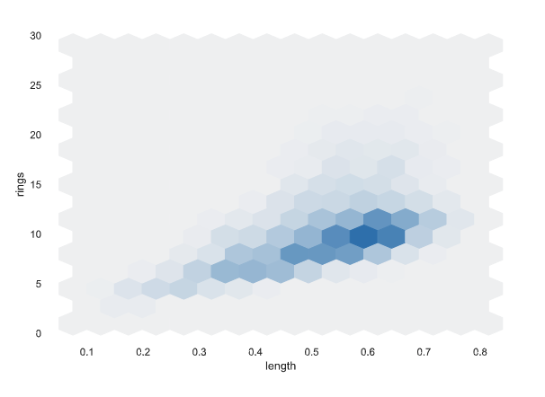
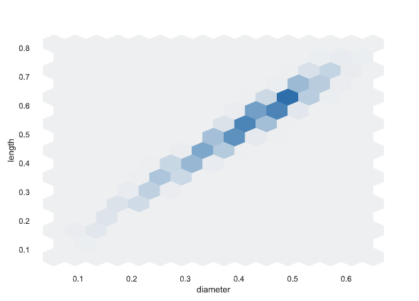
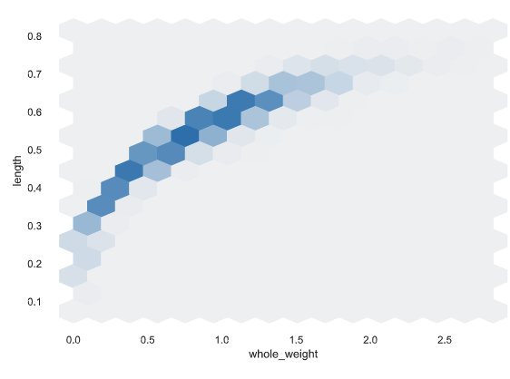
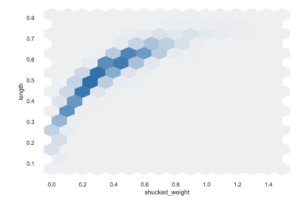
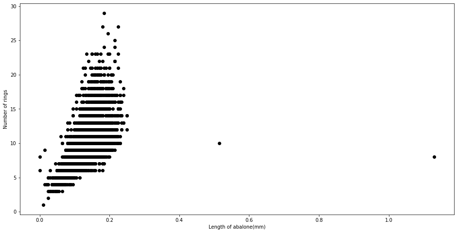
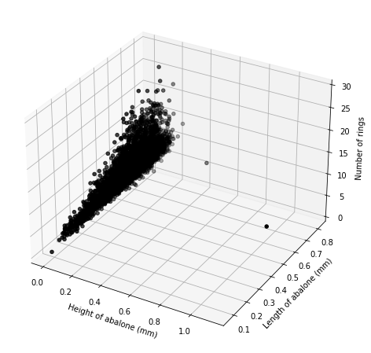

### The Problem ###

Typically, the age of an abalone is determined by cutting the shell through the cone, staining it, and counting the number of rings through a microscope.

This process is tedious and time-consuming. I want to create a machine learning algorithm that could predict the age to a viable degree of accuracy to save time and money.

### The Dataset ###

Link: http://archive.ics.uci.edu/ml/datasets/Abalone

8 attributes
4177 instances

Sex: nominal - M (male), F (female), I (infant)

`Length`: continuous - longest shell measurement (in mm)

`Diameter`: continuous - measurement perpendicular to legnth (in mm)

`Height`: continuous - with meat in shell (in mm)

`Whole weight`: continuous - the whole abalone (in grams)

`Shucked weight`: continuous - weight of the meat (in grams)

`Viscera weight`: continuous - gut weight after bleeding (in grams)

`Shell weight`: continuous - after being dried (in grams)

`Rings`: integer - +1.5 gives the age in years

### Methodology ###
I started off by loading the abalone_data.data file into a data set. I organized the data set into nine columns – **_sex_**, **_length_**, **_diameter_**, **_height_**, **_whole_weight_**, **_shucked_weight_**, **_viscera_weight_**, **_shell_weight_** and **_rings_**. I then explored how each feature affected the age.

      

### Feature Engineering ###
I then used One-Hot encoding to split the sex column into three separate columns – **_sex_F_** (Female), **_sex_I_** (Infant) and **_sex_M_** (Male).

### Modeling ###
I then modeled the prediction algorithm using Scikit-Learn. I wanted to use multiple methods of regression and determine the accuracy of each one. I chose to compare the accuracy using the Root mean squared error.
I compared the following models:
* `LightGBM`
* `Ridge Regressor`
* `Linear Regressor`
* `Bagging Regressor`
* `Lasso Regressor`
* `Random Forest Regressor`

### Results and Discussion ###

The prediction RMSE varied between each regression model chosen, however they were all able to predict the age to a certain degree of accuracy. Below is a table of how each model performed, in order of lowest error to highest error:

Model    | RMSE |
:----------: | :----------: |
LightGBM | 1.509731 |
Ridge Regression  | 1.564081  |
Linear Regression   | 1.564081   |
Bagging    | 1.746120    |
Laso    | 1.889234    |
Random Forest    | 2.242457    |

### Conclusion ###

In predicting the age of abalone using data on its physical attributes, it seems that the LightGBM model performed the best in with the lowest RMSE, while the random forest model performed with the highest RMSE, therefore being the least accurate.

However, it is important to note that RMSE isn’t the only type of error that could be used to judge accuracy. In the future I will try to compare the regression models with R Squared score as well.
