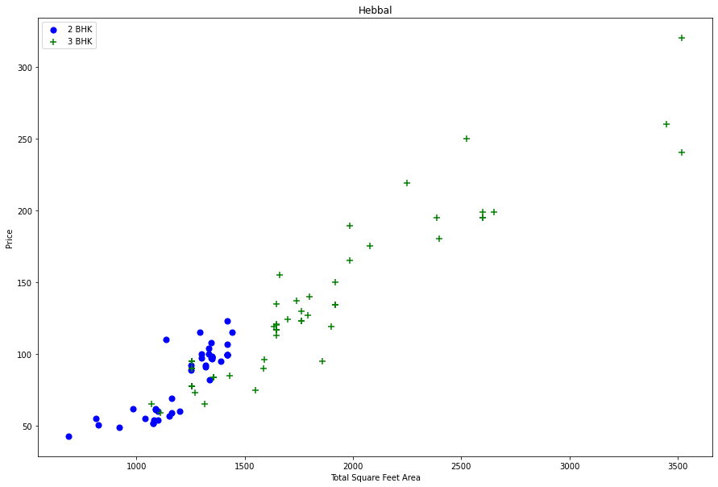
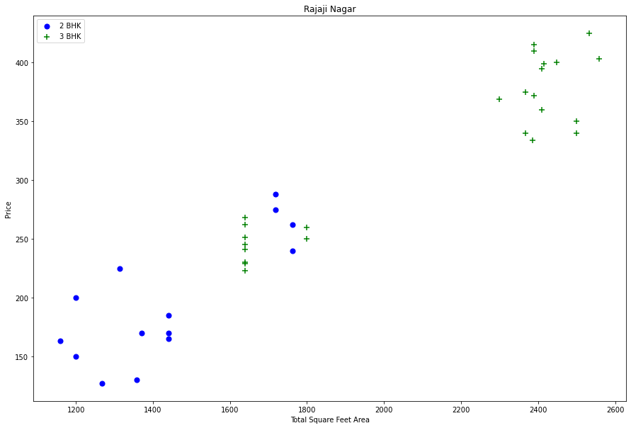
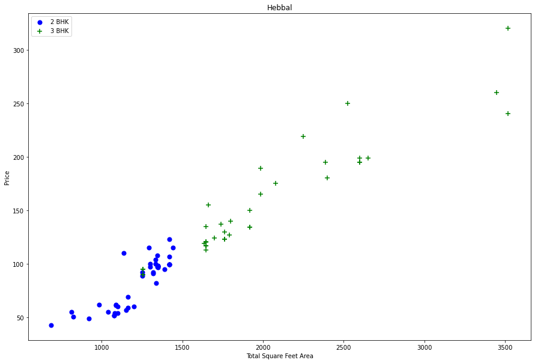
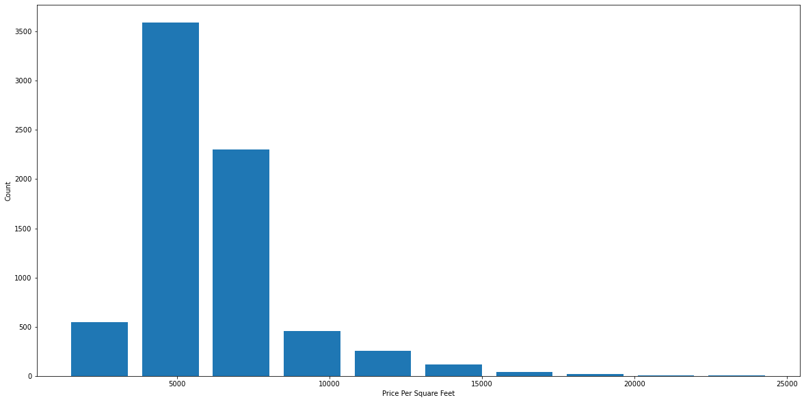
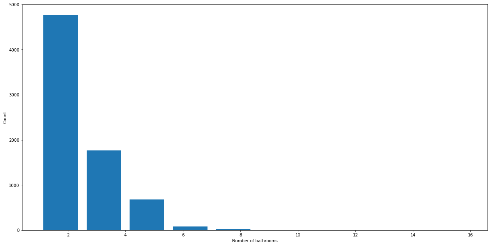
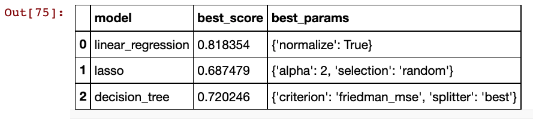
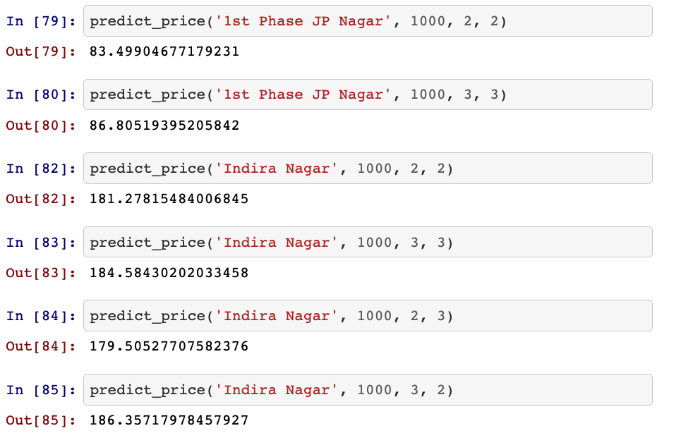

## Bangalore Real Estate Price Prediction ##

### Introduction: Business Problem

Create a machine learning algorithm that would analyze home prices in the city of Bangalore and allow someone do you get an accurate estimate of what a home would cost by selecting the square footage, number of bedrooms, number of bathrooms, and the location.

### Tools and Technology ###

In this project I used the following techniques:
> * Data loading
> 
> * Data cleaning
> 
> * Outlier detection and removal
> 
> * Feature engineering
> 
> * Dimensionality reduction
>
> * GridsearchCV for hyperparameter tunning
>
> * k-fold Cross-Validation

The technology and tools used were:

> * Python
> 
> * Numpy and Pandas for data cleaning
> 
> * Matplotlib for data visualization
> 
> * Sklearn for model building
> 
> * Jupyter notebook, visual studio code and pycharm as IDE

### Dataset ###

I used the **Bengaluru House Price** dataset from Kaggle for this project. It contains the following data:
Dependant Variables (what the model will analyze):
`area_type`
`availability`
`location`
`size`
`society`
`total_sqft`
`bath`
`balcony`

Independent variable (what the model will predict for the user)
`price`

https://www.kaggle.com/amitabhajoy/bengaluru-house-price-data

### Methodology

#### Feature Engineering
The model is going to work using supervised learning, therefore all the data in the data set needs to be labeled.
I then loaded the data set into a pandas dataframe. I chose to drop the availability and society columns as those are unnecessary in order to determine the price of housing. 
The dataset contained 90 NULL values out of 13,300 values, therefore I chose to drop the NULL values as they would have minimal to no impact on the overall data.
I then used a Lambda function to clean up the size column from being alphanumeric characters two integers which would be better read by the model
Then I made a function that cleaned up the square feet column and converted all the data into floats rather than alphanumeric ranges. For the features that were in ranges, such as 2100—2850, the function returned the average of the two values.

After that I created a new column `price_per_sqft` that was the `price` column divided by the `total_sqft` column

I then cleaned up the `location` column. I converted all locations which had less than 10 data points into a location called **other**.

#### Outlier Detection and Removal

Firstly, I removed all the potential erroneous outliers where the number of bedrooms did not match up with the square footage; for example: a property which was listed as having 6 bedrooms in a 600 square foot area (600 square feet generally is too small to contain for 6 bedrooms)

Then I removed every data point where the price per square foot was beyond one standard deviation from the mean. For this, I made sure to do it based on `location`, as the mean price in one location would be different from the other.

Next, I wanted to know if the property prices for two versus 3 bedrooms were different even if they had the similar square footage. To do this I wrote a function that created a scatter graph comparing the two.

What I found is that prices for two-bedroom properties were in fact higher than prices for three-bedroom properties in the same square footage

I then wrote a function that calculated the mean standard deviation and count off each bedroom size and filtered out properties that were outliers.

For example, below we would filter out 2 bedroom properties who’s price_per_sqft is less than the mean price_per_sqft of a 1 bedroom property:

    '1' : {
        'mean': 4000,
        'std: 2000,
        'count': 34
    },
    '2' : {
        'mean': 4300,
        'std: 2300,
        'count': 22
    },    
}

As you can see in the scattered graphs above, the function removed most of the outliers where the price per square footage after three bedrooms was strangely below the mean price of the two bedrooms

### Analysis

Then I plotted a histogram to see how many apartments I have per square foot area in the data set.

As you can see in the scattered graphs above, the function removed most of the outliers where the price per square footage after three bedrooms was strangely below the mean price of the two bedrooms

What I found is a normal distribution graph where the majority of the data points are in the zero to 10,000 rupees per square foot range.

Next I wanted to see the number of bathrooms put a property. I plotted a histogram which showed that the majority of the properties had 1 to 5 bathrooms, as shown below.

#### Bathroom Outlier Detection and removal
Next, I wanted to remove the bathroom outliers. It is safe to say that the majority of properties would not have a largely greater number of bathrooms bam bedrooms. A 3 bedroom property may have four or five bathrooms, but it was highly unlikely that it would have 6 to 10 bathrooms. So I wrote a function that would filter out any property where the number of bathrooms were three or more greater than the number of bedrooms.

### Training the model

Now that the data is all nice and clean, it's time to start training the model. In order to train the model the size and price per square feet features were unnecessary since we cleaned the size feature into the BHK feature and also the price_per_sqft was only 
needed for outlier detection.  

I then used one hot encoding to create dummy columns for each of the locations which held the data that would be used by the model.

After that I use scikit learn to split the model into a training set and testing set and evaluated three different models can you find the one that works best for the price prediction. 
I evaluated a linear regression model, a lasso model and a decision tree model and found that the Linear Regression model performed the best out of the three.

### Results and Discussion
The model was able to predict housing prices with about 81% accuracy. I created a function that would allow the user to predict the price of a property by entering the location the square footage number of baths and the number of bedrooms, which when run would be predicted by the model.

### Future modifications

As specified in the Introduction, the next feature I would like to add to this project would be to use Python flask server to create an interactive web page where one could enter different parameters and get a price prediction for a property out of it.

