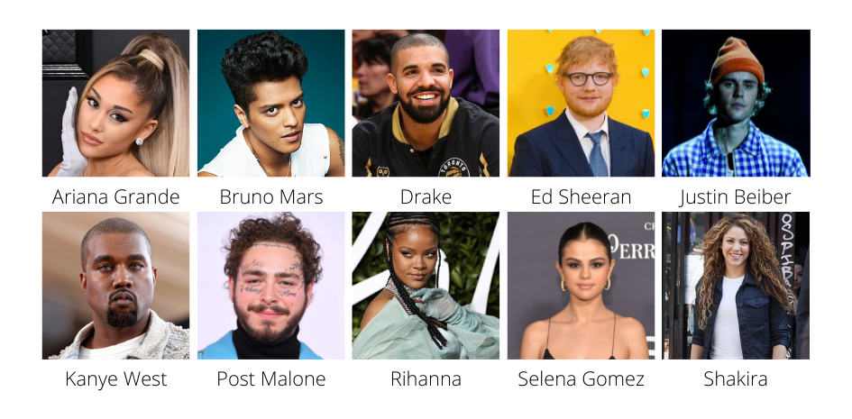
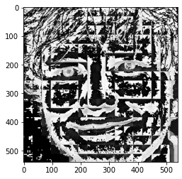
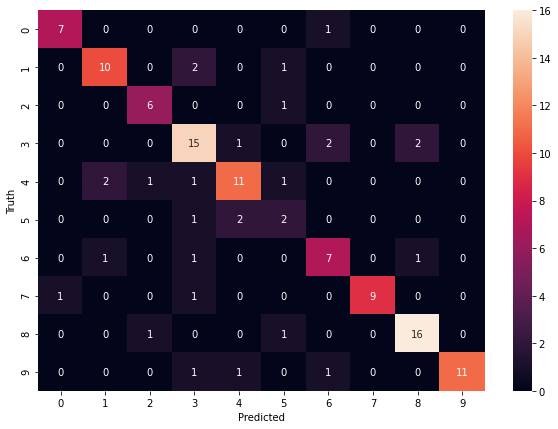
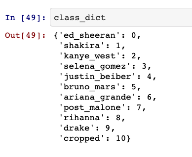

### Introduction: The idea ###
For this project, I wanted to create a facial recognition algorithm that can identify images of people through a dataset of labeled pictures.

### Data
To do this, I scraped data of images of the following pop music artists from google images:

 
`Ariana Grande:  79 images`

`Bruno Mars: 86 images`

`Drake: 89 images`

`Ed Sheeran: 88 images`

`Justin Beiber: 91 images`

`Kanye West: 90 images`

`Post Malone: 94 images`

`Rihanna: 96 images`

`Selena Gomez: 92 images`

`Shakira: 94 images`

### Methodology
The first thing I did was decide which artist I would pick. The reason I picked those 10 was because they all had pretty distinguishable features that I felt the algorithm could use to classify them. 

Next, I used a Chrome plugin called Fatkun batch image downloader to scrape images of the artists off the internet.
Then came the fun part, the data cleaning. There were two major things I needed from the images in order for them to be usable:

1)	The image could not have any object obstructing the face. Being pop artists, a lot of them did, mainly microphones.
2)	The image had to be of the artist alone without any other people.

### Data Cleaning
This brought me to the first step of data cleaning. Manual data cleaning. As in any data science project, this is always the tedious part. I went through each and every image and deleted anything which did not fit the two criteria I mentioned above.
Now it was time to put it into the code.
To start, I used OpenCV to read the image into JupyterLab.
I then created a function OpenCV’s Haar Cascade classifier to detect any face where two eyes were showing and create a bounding box around it out of which anything outside that box would not be analyzed by the machine learning model.

 
 
This function then scrubbed through the hundreds of images in the data set and output it in a form  readable by the model and deleted any image that did not clearly show two eyes or had an object like a hand, drink come on or microphone blocking the artist's face.

Next I created a function that used the PYWavlet library to transform all the cropped faces of the artists into oh wavelet format that extracts the face into different features such as eyes, nose, cheekbones, forehead, chin, etc, into a form that can be understood by the machine learning model.

 
 

### Training the Model
Now that we have the training set ready to go, it was time to start training the model. I to do this I tried multiple training methods in Scikit-Learn, specifically Support Vector Machines, Random Forest Classifier and the Logistic Regression Classifier with hyperparameter tuning to see which classifier performed the best.	

### Results and Discussion

  

As you can see in the results above when the model was tested using new images, It performed with about 80% accuracy. For example in the case of Ed Sheeran (0) the model knew that it was Ed Sheeran 7 out of 8 times, and only one time incorrectly classified Ed Sheeran as Shakira (1).

In the case of Drake however, it classified Drake correctly 11 out of 11 times

### Technologies used in this project: ###
* Python
* Numpy and OpenCV for data cleaning
* Matplotlib & Seaborn for data visualization
* Sklearn for model building
* Jupyter notebook, visual studio code and pycharm as IDE

### Future modifications: ###

Use Python Flask to make a working http/css web page which will be able to classify the images.
