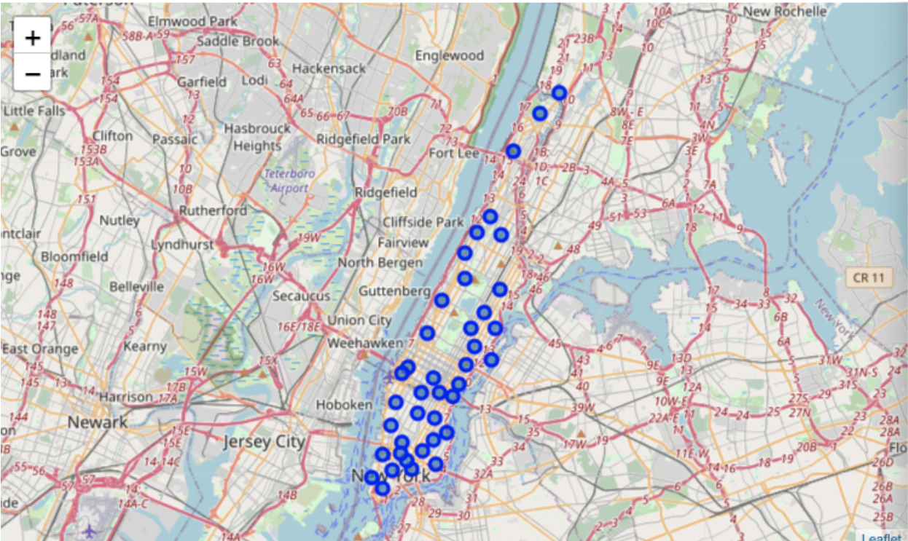
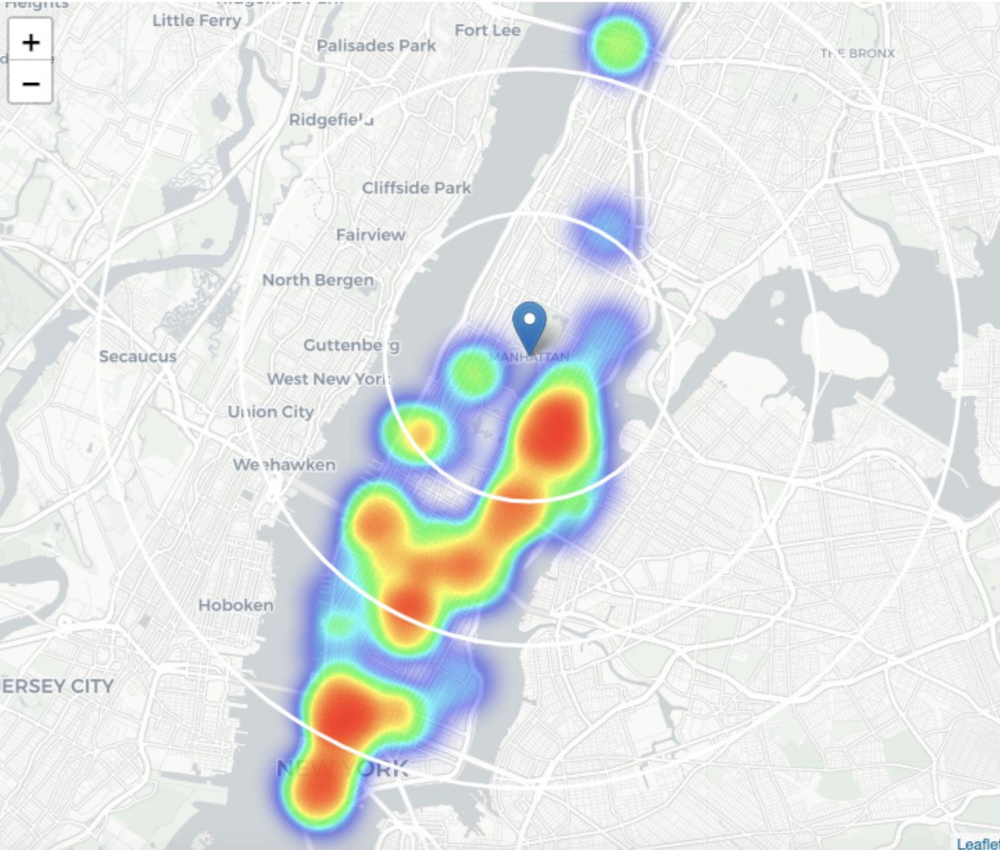

# Analyzing a location to open a new fitness center in Manhattan, New York #

## The Problem ##

Analyzing the number of fitness centers in Manhattan, New York to decide where would be a good location to start a new gym.
Who would be interested in this project: Investors and business owners who would like to start a gym, as well as fitness enthusiasts who would like to live closer to a gym or fitness center.
  
## The Data ##
  
I used the 'newyork_data.json' dataset from IBM, as well as the Foursqaure API to get
the information on gyms and fitness centers in Manhattan
  
## Methodology ##

I started off by loading the newyork_data.json Json file into a data set. I organized the
data set into four columns - Borough, Neighborhood, Latitude and Longitude.
I then took the data from the new york dataset and created a new dataset for just
Manhattan, which consisted of clusters of all the Neighborhoods in Manhattan using
their Latitude and Longitude coordinates
After that I used the Foursquare API combined with the Manhattan Neighborhood
Dataset to get a list of every Gym and Fitness center in the Borough along with their
Latitude and Longitudes.
Then using Folium I generated a heatmap to see the density or 'heat' of the number of
Gyms and Fitness Centers in different parts of Manhattan

## Analysis ##

As you can see, Manhattan is denser (has more neighborhoods) toward the water and
the South West end of the borough, and less dense in the North East end.
  

Here we see a heatmap of the gyms and fitness centers and you can immediately notice
that there are more gyms towards the Southern end of Manhattan than the Northern end
(much like the density of the neighborhoods).

## Results and Discussion ##

Viewing the analysis shows us that Manhattan has a lot more neighborhoods towards
its Southern end, and it also has more gyms and fitness centers in that direction.
It seems to have the highest number of fitness centers in the Financial District and
Upper East Side and very few in Harlem, Carnegie Hill and Manhattan Valley - these
neighborhoods could be ideal opportunities in terms of the lack of fitness centers

## Conclusion ##
This report simply explored the oppurtinity for opening a new gym or fitness center in
Manhattan purely based on how many other fitness centers were in each neighborhood
of Manhattan.
A business owner has oppurtuny in the North side of Manhattan solely based on the
advantage of the lack of competition, however it is encouraged to use this report as a
guide to collect additional information on the less dense neighborhoods, such as
income, population density and more.

