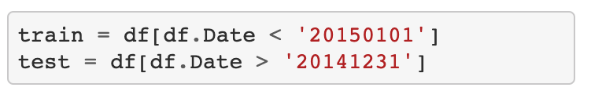
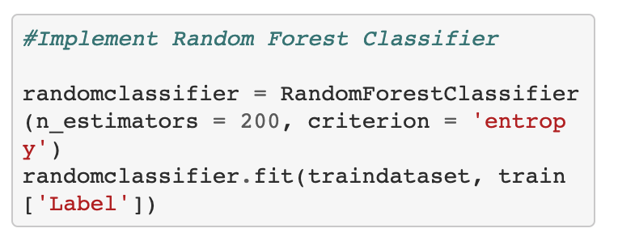

## Sentiment Analysis of Stock Movements using New Headlines ##

### Introduction: Business Problem

I wanted to analyze the news headlines from the years 2008 to 2016 and see what effect they had on stock prices, and then create a model that could predict future stock prices based on news headlines.

### Tools and techniques used
•	Pandas
•	Scikit-Learn
•	CountVectorizer
•	RandomForestClassifier
•	BagOfWords

### Data
The dataset I used was one from Kaggle that contains stock prices from August 2008 to June 2016. This data set contains the following columns:
*	`Date`: The date of the new headlines
*	`Label`: Taken from Yahoo Finance - https://finance.yahoo.com/quote/%5EDJI/history?p=%5EDJI&guccounter=1 - This is based on the Dow Jones Industrial Average for that date. The label reads ‘1’ when the DJIA’s adj close value rose or stayed the same, and ‘0’ when it decreased.
*	`Top1` `Top2` `Top3` `Top4` `Top5` `Top6` `Top7` `Top8` `Top9` `Top10` `Top11` `Top12` `Top13` `Top14` `Top15` `Top16` `Top17` `Top18` `Top19` `Top20` `Top21` `Top22` `Top23` `Top24` `Top25`: The top 25 news headlines for the day based on Reddit’s hot sorting feature
https://www.kaggle.com/aaron7sun/stocknews

### Methodology
The first thing I did was put the data set into a pandas dataframe and split it into a training set and a testing set. The training set was all data from August 2008 up until December 31st 2014, and the testing set contained everything from January 1st 2015 up until June 31st 2016.

 

#### Data Cleaning
The first thing I noticed that there were a lot of punctuation marks that were unnecessary for the model so I created a function that use regular expression that removed anything that was not a character from A to Z.

Then I changed the names of all the headline columns 2 numbers from zero to 25 to make it easier for the model to read.

After that I wrote a function that took all the text data from the news headlines and converted it all to lowercase for more convenient  processing.
After that I took all the different features of each news headline and combined it into one big sentence separated by spaces

I then used CountVectorizer to convert all the words into  vectors that the model would read as either 1 or 0
While doing this I chose not to remove stop words as in news headlines every word could have  an effect on the increase or decrease of stock prices.

I then used scikit learn's random forest classifier to train the data set.

### Results and Discussion

When implemented on the testing set the model  able to predict the headlines to an accuracy of 81%
 

### Conclusion
This was a pretty fun project. I feel sentiment analysis is a very powerful machine learning tool and can show us a lot of insights with the millions of data sets we have available on the Internet. The model's performance was satisfactory in what it was needed for, and it will be fun to see what other aspects off sentiment analysis I can apply this kind of machine learning algorithm to.

